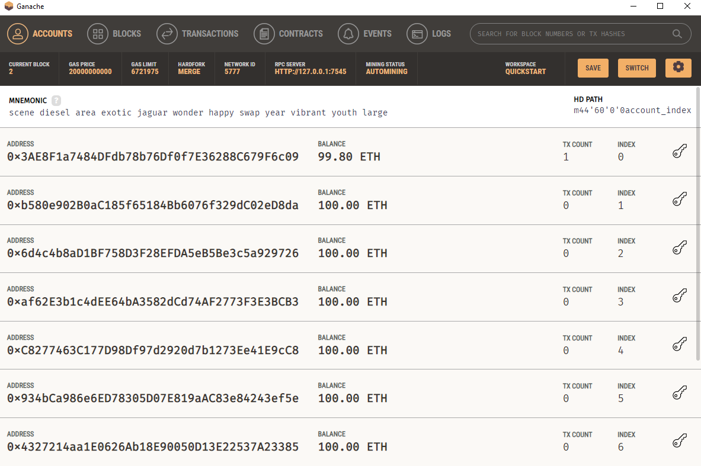
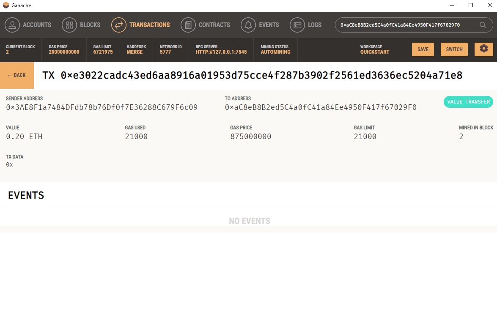

# Crypto transactions
This application allows users to select and pay to hire a fintech professional in crypto. It connects to a ganache blockchain and allows you to complete a transaction to any user in a drop-down list..

## Technologies
This notebook runs on streamlit.
The program uses the web3, bip44, and streamlit libraries.

## Installation Guide
Install python 3.7.15, as well as the required libraries. 

Download Ganache from https://trufflesuite.com/ganache/

To install version 5.17 of web3 use the following command:

pip install web3==5.17

To install the latest version of streamlit use the following command:

pip install streamlit 

To install the latest version of bip44 use the following command:

pip install bip44

## Usage
First, the ganache blockchain must be started. Initiate Ganache and quickstart an ethereum blockchain. In the local directory, save a .env file containing the list of words that appears on the screen as MNEMONIC = 'list of words generated by ganache here'

To run the application navigate to the folder containing fintech_finder.py using your terminal application and type 'streamlit run fintech_finder.py'
A screen will appear on your web browser containing the application. Review the list of fintech professionals on the main screen, and select who you would like to hire and for how many hours.

Press the send transaction button to generate the transaction hash and send the transaction to the Ganache blockchain. Review the transaction on the Ganache blockchain.

The balance of your account will update after the transaction is complete

The transaction will be recorded under the transactions tab, noting the from and to addresses, value, and gas price of the transaction.

## Contributors

By Brian Wander
brianwander101@gmail.com
www.linkedin.com/in/brian-wander

---

## License

MIT license.
